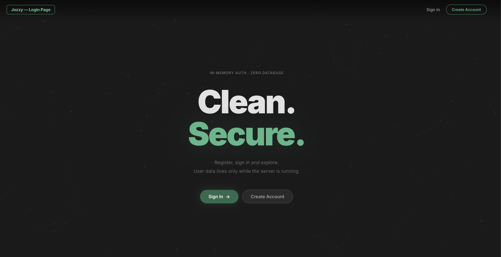
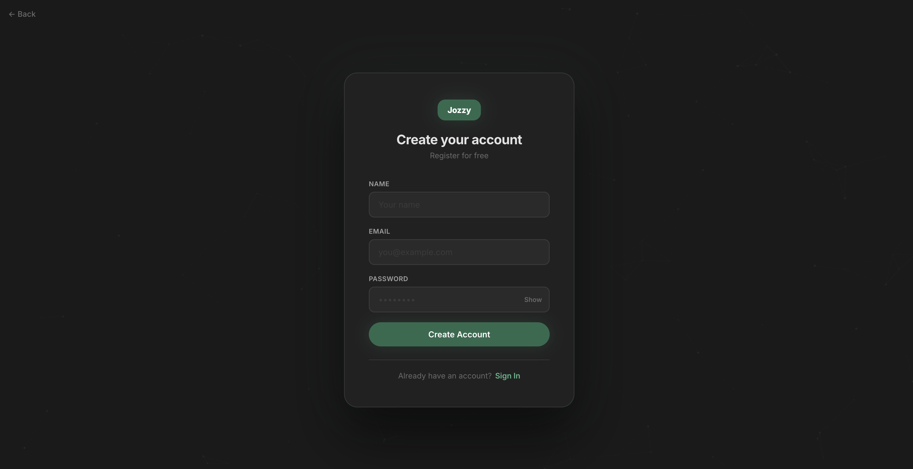
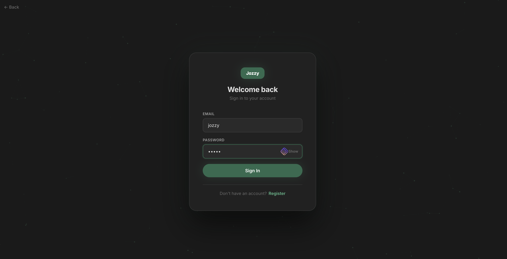
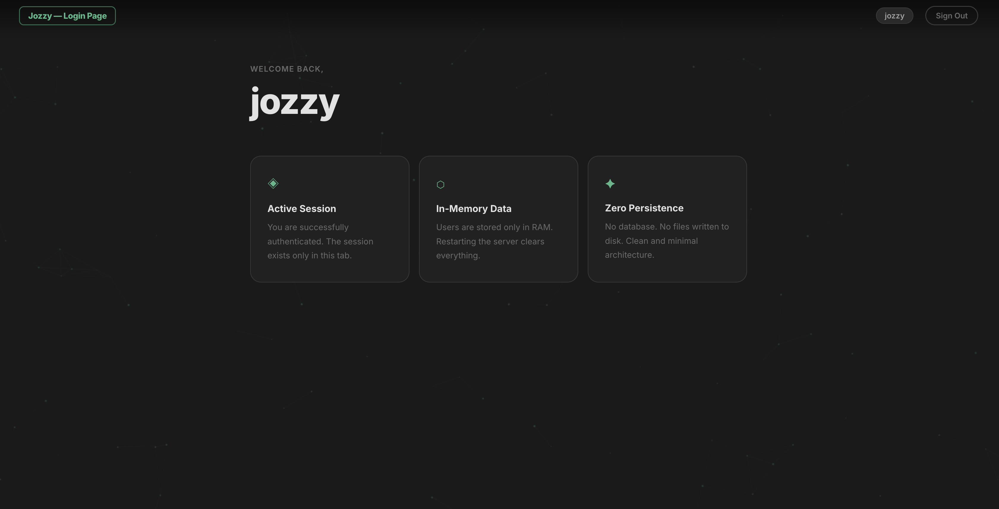

# Jozzy — Login Page

A clean, minimal authentication UI built with pure HTML, CSS and Node.js. Users are stored in a JSON file and persist across server restarts. No frameworks, no database — just the fundamentals.

---

## Screenshots

### Home


### Sign In


### Create Account


### Dashboard


---

## Features

- Sign in and account creation with real validation
- Users persisted to `users.json` — survive server restarts
- Show / hide password toggle
- Animated particle background
- Fully responsive layout
- Dark theme — charcoal grey, deep green, black

---

## Tech Stack

| Technology | Role |
|---|---|
| **HTML5** | Page structure and semantics |
| **CSS3** | Styling, animations, responsive layout |
| **JavaScript (Vanilla)** | Client-side form logic and API calls |
| **Node.js** | HTTP server, routing, JSON persistence |
| **Google Fonts — Inter** | Typography |
| **Canvas API** | Animated particle background |

No external frameworks. No build tools. Zero dependencies beyond Node.js.

---

## Installation

**Requirements:** [Node.js](https://nodejs.org) installed on your machine.

```bash
# 1. Clone the repository
git clone https://github.com/jovbcorreia/loginPage.git

# 2. Enter the project folder
cd loginPage

# 3. Start the server
npm start
```

Then open your browser at **http://localhost:3000**

> Do not open the `.html` files directly — they must be served through the Node.js server for authentication to work.

---

## Default Users

Two demo accounts are pre-loaded on first run:

| Name | Email | Password |
|---|---|---|
| Demo User | demo@example.com | demo123 |
| Admin | admin@example.com | admin123 |

New accounts registered through the UI are saved to `users.json` automatically.

---

## License

MIT License

Created and licensed by **João Vilas Boas Correia** © 2026
